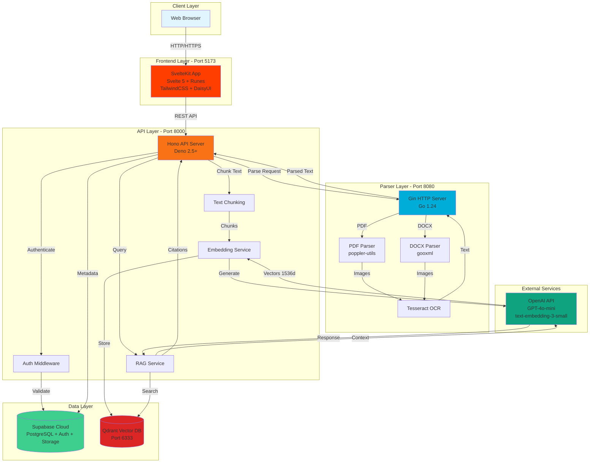
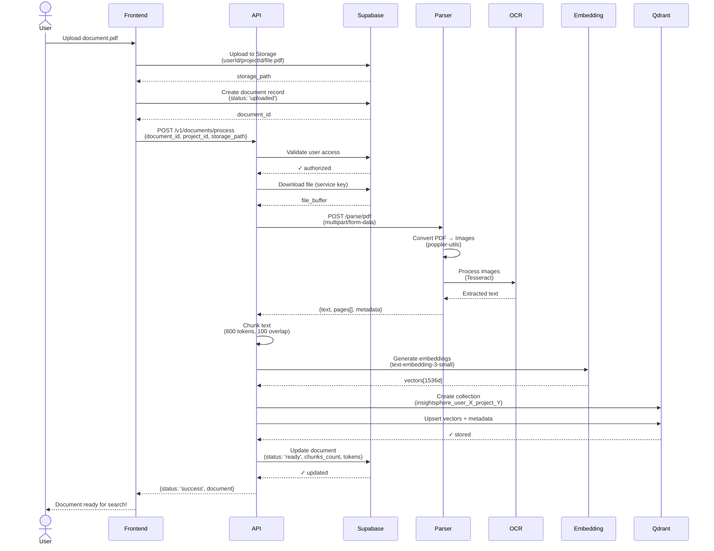
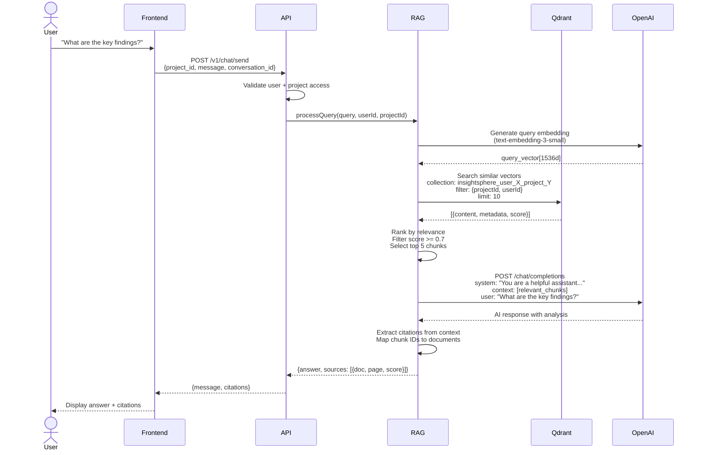

# System Architecture

**Comprehensive guide to InsightSphere's technical architecture, service organization, and system design.**

---

## Table of Contents

1. [System Overview](#system-overview)
2. [Monorepo Organization](#monorepo-organization)
3. [Service Architecture](#service-architecture)
4. [Database Architecture](#database-architecture)
5. [Vector Architecture](#vector-architecture)
6. [API Architecture](#api-architecture)
7. [Frontend Architecture](#frontend-architecture)
8. [Parser Service Architecture](#parser-service-architecture)
9. [Data Flow Diagrams](#data-flow-diagrams)
10. [Deployment Architecture](#deployment-architecture)
11. [Security Architecture](#security-architecture)
12. [Scalability Considerations](#scalability-considerations)

---

## System Overview

InsightSphere is a **document intelligence platform** built on a microservices architecture with RAG capabilities. The system enables users to:

- Upload documents to project-based collections
- Extract text via OCR processing
- Generate semantic embeddings for vector search
- Query documents using natural language
- Receive AI-powered responses with source citations

### High-Level Architecture

```
┌──────────────┐     ┌──────────────┐     ┌──────────────┐     ┌──────────────┐
│   Frontend   │────→│   API (Deno) │────→│  Parser (Go) │────→│   Supabase   │
│  SvelteKit   │     │   Hono       │     │  Tesseract   │     │  PostgreSQL  │
│  Port: 5173  │     │  Port: 8000  │     │  Port: 8080  │     │    Cloud     │
└──────────────┘     └──────┬───────┘     └──────────────┘     └──────────────┘
                            │
                            │
                     ┌──────▼───────┐
                     │    Qdrant    │
                     │  Vector DB   │
                     │  Port: 6333  │
                     └──────────────┘
```

### Technology Stack

| Layer | Technology | Version | Purpose |
|-------|-----------|---------|---------|
| **Frontend** | SvelteKit | 2.25+ | Web application framework |
| | Svelte | 5.36+ | Reactive UI components with runes |
| | TailwindCSS | 4.1+ | Utility-first CSS |
| | DaisyUI | 5.0+ | Component library |
| **API** | Deno | 2.5+ | JavaScript/TypeScript runtime |
| | Hono | 4.0+ | Web framework |
| | TypeScript | 5.8+ | Type-safe development |
| **Parser** | Go | 1.24+ | High-performance microservice |
| | Tesseract OCR | Latest | Text extraction from images |
| | poppler-utils | Latest | PDF manipulation |
| | Gin | Latest | Web framework |
| **Vector DB** | Qdrant | Latest | Semantic search engine |
| **Database** | Supabase | Cloud | PostgreSQL + Auth + Storage |
| **AI Models** | OpenAI | Latest | GPT-4o-mini, text-embedding-3-small |

---

## Architecture Diagrams

### Diagram 1: System Architecture Overview



### Diagram 2: Document Processing Sequence



### Diagram 3: RAG Query Flow



### Diagram 4: Qdrant Collection Structure

```mermaid
graph TB
    subgraph "Per-Project Isolation"
        C1[Collection:<br/>insightsphere_user_A1_project_X1]
        C2[Collection:<br/>insightsphere_user_A1_project_X2]
        C3[Collection:<br/>insightsphere_user_B2_project_Y1]
    end

    subgraph "Collection Schema"
        Vector[Vector: float32[1536]<br/>OpenAI text-embedding-3-small]
        Payload[Payload Metadata]
    end

    subgraph "Metadata Fields"
        M1[documentId: string]
        M2[projectId: string]
        M3[userId: string]
        M4[content: string<br/>Original text chunk]
        M5[pageNumber: number]
        M6[chunkIndex: number]
        M7[fileName: string]
        M8[fileType: 'pdf' | 'docx']
        M9[createdAt: timestamp]
    end

    C1 --> Vector
    C2 --> Vector
    C3 --> Vector
    Vector --> Payload
    Payload --> M1
    Payload --> M2
    Payload --> M3
    Payload --> M4
    Payload --> M5
    Payload --> M6
    Payload --> M7
    Payload --> M8
    Payload --> M9

    subgraph "Search Query"
        Q1[Generate query embedding<br/>text-embedding-3-small]
        Q2[Search in collection<br/>insightsphere_user_A1_project_X1]
        Q3[Filter: projectId = X1<br/>userId = A1]
        Q4[Return top 10 results<br/>score >= 0.7]
    end

    Q1 --> Q2
    Q2 --> Q3
    Q3 --> Q4

    subgraph "Benefits"
        B1[✓ Perfect data isolation]
        B2[✓ Easy project deletion]
        B3[✓ Clear access control]
        B4[✓ Optimized per-project search]
    end

    style C1 fill:#dc2626
    style C2 fill:#dc2626
    style C3 fill:#dc2626
    style Vector fill:#f97316
    style Payload fill:#3b82f6
    style M4 fill:#10b981
```

---

## Monorepo Organization

InsightSphere uses a **monorepo structure** with clear separation of concerns:

```
insightsphere/
├── .claude/                    # AI agent documentation
│   ├── agents/                # Specialized agent definitions
│   ├── context/               # Deep technical documentation
│   └── CLAUDE.md              # Quick reference guide
│
├── .cursor/                    # IDE configuration
│   └── rules/                 # Cursor IDE guidelines
│
├── api/                        # Deno API server (main backend)
│   ├── lib/                   # Core services and utilities
│   │   ├── chunkText.ts               # Text chunking with overlap
│   │   ├── embeddingClient.ts         # Embedding generation
│   │   ├── openaiClient.ts            # OpenAI API client
│   │   ├── qdrantClient.ts            # Vector database client
│   │   ├── supabaseClient.ts          # Supabase client
│   │   └── constants.ts               # System constants
│   ├── routes/                # API endpoint handlers
│   │   ├── documents/                 # Document processing
│   │   ├── search/                    # Vector search
│   │   └── test/                      # Testing endpoints
│   ├── main.ts                # API entry point
│   └── deno.jsonc             # Deno configuration
│
├── doc-parser/                 # Go microservice (OCR pipeline)
│   ├── main.go                # Parser entry point
│   ├── go.mod                 # Go dependencies
│   └── Dockerfile             # Container configuration
│
├── frontend/                   # SvelteKit application
│   ├── src/
│   │   ├── lib/
│   │   │   ├── components/           # Svelte components
│   │   │   ├── stores/               # Svelte stores (state management)
│   │   │   └── utils/                # Utility functions
│   │   ├── routes/                   # SvelteKit file-based routing
│   │   └── app.html                  # HTML template
│   ├── static/                # Static assets
│   ├── package.json           # Node dependencies
│   ├── svelte.config.js       # Svelte configuration
│   ├── vite.config.ts         # Vite build configuration
│   └── tailwind.config.js     # TailwindCSS configuration
│
├── shared/                     # Shared TypeScript types
│   └── types/                 # Common type definitions
│
├── vector-utils/               # Qdrant utilities (legacy/helpers)
│
├── dev/                        # Development environment
│   ├── compose.yaml           # Docker Compose configuration
│   ├── .env.example           # Environment template
│   └── start.sh               # Development startup script
│
└── README.md                   # Project documentation
```

### Key Organizational Principles

1. **Clear Boundaries**: Each service (api, doc-parser, frontend) is self-contained
2. **Shared Types**: Common type definitions in `shared/` prevent duplication
3. **Configuration Centralization**: Dev environment managed via Docker Compose
4. **Documentation Layering**: `.claude/` for AI, `.cursor/` for IDE, root-level for humans

---

## Service Architecture

InsightSphere follows a **microservices architecture** with three primary services:

### 1. Frontend Service (SvelteKit)

**Purpose**: User interface and client-side state management

- **Port**: 5173 (dev), Production varies
- **Framework**: SvelteKit 2 + Svelte 5
- **Responsibilities**:
  - User authentication (Supabase Auth)
  - Project and document management UI
  - File upload interface
  - AI chat interface with streaming responses
  - Real-time status updates

**Key Features**:
- **Svelte 5 Runes**: `$state`, `$derived`, `$effect` for reactive state
- **File-Based Routing**: SvelteKit's convention-based routing
- **Server-Side Rendering (SSR)**: SEO and performance optimization
- **Supabase Integration**: Direct client-side auth and storage

### 2. API Service (Deno + Hono)

**Purpose**: Business logic orchestration and RAG pipeline management

- **Port**: 8000
- **Framework**: Hono (lightweight web framework)
- **Responsibilities**:
  - JWT authentication and authorization
  - Document processing orchestration
  - Embedding generation (OpenAI)
  - Vector database operations (Qdrant)
  - Search query handling
  - LLM chat completion (GPT-4o-mini)
  - Database operations (Supabase)

**Key Features**:
- **Deno Runtime**: Secure by default, built-in TypeScript
- **Stateless Design**: No session storage (JWT-based auth)
- **Async Operations**: Promise-based for concurrent processing
- **Error Handling**: Structured error responses with proper HTTP codes

### 3. Parser Service (Go + Tesseract)

**Purpose**: High-performance OCR document parsing

- **Port**: 8080
- **Framework**: Gin (Go web framework)
- **Responsibilities**:
  - PDF → Image conversion (poppler-utils)
  - Image → Text extraction (Tesseract OCR)
  - Page-level text extraction
  - DOCX parsing (future)
  - File system management

**Key Features**:
- **Concurrent Processing**: Goroutines for parallel page extraction
- **Memory Efficiency**: Streaming and cleanup for large files
- **Context-Based Timeouts**: Prevent long-running operations
- **Health Checks**: Readiness probes for orchestration

### Service Communication

```
Frontend → API:     HTTP/REST + JWT Authentication
API → Parser:       HTTP/REST + JSON payloads
API → Qdrant:       gRPC client (via @qdrant/js-client-rest)
API → Supabase:     HTTPS REST API + Service Role Key
API → OpenAI:       HTTPS REST API + API Key
```

---

## Database Architecture

InsightSphere uses **Supabase** (PostgreSQL) for relational data storage.

### Supabase Components

1. **PostgreSQL Database**: Core data storage
2. **Auth**: User authentication and session management
3. **Storage**: Document file storage (pre-processing)
4. **Row-Level Security (RLS)**: Data isolation per user

### Database Schema

#### Tables

##### **users**
- **Source**: Managed by Supabase Auth
- **Purpose**: User accounts and authentication
- **Key Fields**:
  - `id` (UUID, primary key)
  - `email` (text, unique)
  - `created_at` (timestamp)

##### **projects**
- **Purpose**: Project organization for documents
- **Schema**:
```sql
CREATE TABLE projects (
  id UUID PRIMARY KEY DEFAULT gen_random_uuid(),
  user_id UUID REFERENCES auth.users(id) NOT NULL,
  name TEXT NOT NULL,
  description TEXT,
  created_at TIMESTAMP WITH TIME ZONE DEFAULT NOW(),
  updated_at TIMESTAMP WITH TIME ZONE DEFAULT NOW()
);

-- RLS Policies
ALTER TABLE projects ENABLE ROW LEVEL SECURITY;

CREATE POLICY "Users can view own projects"
  ON projects FOR SELECT
  USING (auth.uid() = user_id);

CREATE POLICY "Users can create own projects"
  ON projects FOR INSERT
  WITH CHECK (auth.uid() = user_id);
```

##### **documents**
- **Purpose**: Document metadata and processing status
- **Schema**:
```sql
CREATE TABLE documents (
  id UUID PRIMARY KEY DEFAULT gen_random_uuid(),
  project_id UUID REFERENCES projects(id) ON DELETE CASCADE,
  user_id UUID REFERENCES auth.users(id) NOT NULL,
  file_name TEXT NOT NULL,
  file_type TEXT NOT NULL,  -- 'pdf', 'docx', etc.
  file_size BIGINT,
  storage_path TEXT NOT NULL,  -- Supabase Storage path
  processing_status TEXT DEFAULT 'pending',  -- 'pending', 'processing', 'completed', 'failed'
  processing_error TEXT,
  page_count INTEGER,
  chunk_count INTEGER,
  created_at TIMESTAMP WITH TIME ZONE DEFAULT NOW(),
  processed_at TIMESTAMP WITH TIME ZONE
);

-- Indexes
CREATE INDEX idx_documents_project_id ON documents(project_id);
CREATE INDEX idx_documents_user_id ON documents(user_id);
CREATE INDEX idx_documents_status ON documents(processing_status);

-- RLS Policies
ALTER TABLE documents ENABLE ROW LEVEL SECURITY;

CREATE POLICY "Users can view own documents"
  ON documents FOR SELECT
  USING (auth.uid() = user_id);
```

##### **document_summaries** (future)
- **Purpose**: AI-generated document summaries
- **Schema**:
```sql
CREATE TABLE document_summaries (
  id UUID PRIMARY KEY DEFAULT gen_random_uuid(),
  document_id UUID REFERENCES documents(id) ON DELETE CASCADE,
  summary TEXT NOT NULL,
  model TEXT NOT NULL,  -- 'gpt-4o-mini'
  created_at TIMESTAMP WITH TIME ZONE DEFAULT NOW()
);
```

### Storage Buckets

#### **documents**
- **Purpose**: Store uploaded PDF/DOCX files before processing
- **Path Structure**: `{userId}/{projectId}/{documentId}/{fileName}`
- **Access Control**: Private, RLS-enabled
- **Retention**: Files kept after processing for re-processing

**Example Upload**:
```typescript
const filePath = `${userId}/${projectId}/${documentId}/${file.name}`;
const { data, error } = await supabase.storage
  .from('documents')
  .upload(filePath, file);
```

### Data Flow

1. **User uploads file** → Supabase Storage (`documents` bucket)
2. **API creates document record** → PostgreSQL (`documents` table)
3. **API triggers processing** → Parser extracts text → Qdrant stores embeddings
4. **API updates document status** → PostgreSQL (`documents.processing_status`)

---

## Vector Architecture

InsightSphere uses **Qdrant** for semantic vector search.

### Qdrant Overview

- **Deployment**: Docker container (dev), Qdrant Cloud (prod recommended)
- **Ports**: 6333 (HTTP), 6334 (gRPC)
- **Data Model**: Points (vectors + metadata)

### Collection Strategy: Per-Project Isolation

**Critical Design Decision**: Each project gets its own Qdrant collection.

#### Collection Naming Convention

```typescript
`insightsphere_user_{userId}_project_{projectId}`
```

**Example**:
```
insightsphere_user_a1b2c3_project_x7y8z9
```

#### Why Per-Project Collections?

1. **Data Isolation**: Perfect separation between projects
2. **Query Performance**: Smaller collections = faster searches
3. **Delete Simplicity**: Drop entire collection when project deleted
4. **Access Control**: Collection name enforces user/project boundary
5. **Scalability**: Distribute collections across Qdrant cluster nodes

### Vector Configuration

```typescript
// Collection creation
await qdrantClient.createCollection(collectionName, {
  vectors: {
    size: 1536,                    // OpenAI text-embedding-3-small dimensions
    distance: "Cosine"             // Similarity metric
  }
});
```

### Point Structure

Each document chunk becomes a **point** in Qdrant:

```typescript
{
  id: string,                      // UUID for the chunk
  vector: number[],                // 1536-dimensional embedding
  payload: {
    documentId: string,            // References documents table
    projectId: string,             // Project identifier
    userId: string,                // User identifier (redundant but useful)
    chunkIndex: number,            // 0-based chunk position in document
    text: string,                  // Original chunk text (for citations)
    fileName: string,              // Source file name
    fileType: string,              // 'pdf', 'docx', etc.
    pageNumber?: number,           // Page number (PDFs only)
    createdAt: string              // ISO timestamp
  }
}
```

**Example Point**:
```json
{
  "id": "550e8400-e29b-41d4-a716-446655440000",
  "vector": [0.023, -0.891, ..., 0.456],
  "payload": {
    "documentId": "doc-123",
    "projectId": "proj-456",
    "userId": "user-789",
    "chunkIndex": 0,
    "text": "The quarterly revenue increased by 23% compared to the previous year...",
    "fileName": "Q3-2024-Report.pdf",
    "fileType": "pdf",
    "pageNumber": 1,
    "createdAt": "2024-11-29T10:30:00Z"
  }
}
```

### Search Operations

#### Basic Semantic Search

```typescript
const results = await qdrantClient.search(collectionName, {
  vector: queryEmbedding,          // 1536-dimensional query vector
  limit: 10,                       // Top 10 results
  score_threshold: 0.7             // Minimum similarity score
});
```

#### Filtered Search (by document)

```typescript
const results = await qdrantClient.search(collectionName, {
  vector: queryEmbedding,
  limit: 10,
  filter: {
    must: [
      { key: "documentId", match: { value: "doc-123" } }
    ]
  }
});
```

### Lifecycle Management

1. **Create Collection**: When first document uploaded to project
2. **Add Points**: Batch insert after document processing
3. **Search Points**: On every user query
4. **Delete Points**: When individual document deleted
5. **Drop Collection**: When entire project deleted

**Important**: Always check collection existence before operations:

```typescript
const collections = await qdrantClient.getCollections();
const exists = collections.collections.some(c => c.name === collectionName);

if (!exists) {
  await qdrantClient.createCollection(collectionName, config);
}
```

---

## API Architecture

The API service is the **orchestration layer** for all business logic.

### Hono Framework

**Why Hono?**
- **Lightweight**: Minimal overhead, fast startup
- **Edge-Ready**: Works on Deno, Node, Cloudflare Workers, Bun
- **Middleware**: Clean composition for auth, logging, CORS
- **Type-Safe**: Full TypeScript support with context typing

### Routing Structure

```typescript
// main.ts
import { Hono } from "hono";
import { logger } from "hono/logger";
import { cors } from "hono/cors";

const app = new Hono();

// Middleware
app.use("*", logger());
app.use("*", cors({
  origin: ["http://localhost:5173"],  // Frontend origin
  credentials: true
}));

// Routes
app.route("/v1/documents", documentsRoutes);
app.route("/v1/search", searchRoutes);
app.route("/v1/test", testRoutes);

// Health check
app.get("/health", (c) => c.json({ status: "healthy" }));

Deno.serve({ port: 8000 }, app.fetch);
```

### Authentication Middleware

```typescript
import { Context, Next } from "hono";
import { createClient } from "@supabase/supabase-js";

export async function authMiddleware(c: Context, next: Next) {
  const authHeader = c.req.header("Authorization");

  if (!authHeader || !authHeader.startsWith("Bearer ")) {
    return c.json({ error: "Unauthorized" }, 401);
  }

  const token = authHeader.substring(7);

  // Verify JWT with Supabase
  const supabase = createClient(
    Deno.env.get("SUPABASE_URL")!,
    Deno.env.get("SUPABASE_SERVICE_ROLE_KEY")!
  );

  const { data: { user }, error } = await supabase.auth.getUser(token);

  if (error || !user) {
    return c.json({ error: "Invalid token" }, 401);
  }

  // Attach user to context
  c.set("user", user);
  c.set("userId", user.id);

  await next();
}
```

### Core API Endpoints

#### **POST /v1/documents/process**
- **Purpose**: Process uploaded document through RAG pipeline
- **Auth**: Required (JWT)
- **Payload**:
```json
{
  "project_id": "uuid",
  "document_id": "uuid",
  "storage_path": "userId/projectId/docId/file.pdf"
}
```
- **Response**:
```json
{
  "success": true,
  "documentId": "uuid",
  "chunks": 42,
  "pages": 10,
  "processingTime": "12.3s"
}
```
- **Flow**:
  1. Validate user owns project
  2. Download file from Supabase Storage
  3. Call parser service (PDF → Text)
  4. Chunk text (800 tokens, 100 overlap)
  5. Generate embeddings (OpenAI)
  6. Store in Qdrant
  7. Update document status in Supabase

#### **POST /v1/search/query**
- **Purpose**: Search documents using natural language
- **Auth**: Required (JWT)
- **Payload**:
```json
{
  "query": "What are the key findings?",
  "project_id": "uuid",
  "limit": 10,
  "score_threshold": 0.7
}
```
- **Response**:
```json
{
  "results": [
    {
      "text": "The key findings indicate...",
      "score": 0.89,
      "documentId": "uuid",
      "fileName": "report.pdf",
      "pageNumber": 3
    }
  ],
  "query": "What are the key findings?",
  "processingTime": "0.8s"
}
```
- **Flow**:
  1. Validate user owns project
  2. Generate query embedding (OpenAI)
  3. Search Qdrant collection
  4. Return top results with metadata

#### **POST /v1/chat/completion**
- **Purpose**: AI chat with document context
- **Auth**: Required (JWT)
- **Payload**:
```json
{
  "messages": [
    { "role": "user", "content": "Summarize the key points" }
  ],
  "project_id": "uuid",
  "stream": true
}
```
- **Response**: Server-Sent Events (SSE) stream or JSON
- **Flow**:
  1. Search relevant documents (RAG retrieval)
  2. Build context from top results
  3. Call OpenAI GPT-4o-mini with context
  4. Stream or return response

### Error Handling

```typescript
app.onError((err, c) => {
  console.error("Error:", err);

  if (err instanceof ValidationError) {
    return c.json({ error: err.message }, 400);
  }

  if (err instanceof AuthError) {
    return c.json({ error: "Unauthorized" }, 401);
  }

  return c.json({ error: "Internal server error" }, 500);
});
```

---

## Frontend Architecture

The frontend uses **SvelteKit 2** with **Svelte 5 runes** for reactive state management.

### SvelteKit Structure

```
frontend/src/
├── routes/
│   ├── +layout.svelte            # Root layout
│   ├── +layout.ts                # Root layout data
│   ├── +page.svelte              # Home page
│   ├── auth/
│   │   ├── login/+page.svelte
│   │   └── signup/+page.svelte
│   ├── projects/
│   │   ├── +page.svelte                    # Project list
│   │   └── [projectId]/
│   │       ├── +page.svelte                # Project detail
│   │       └── documents/
│   │           └── [documentId]/+page.svelte
│   └── chat/
│       └── [projectId]/+page.svelte
│
├── lib/
│   ├── components/
│   │   ├── ui/                   # Reusable UI components
│   │   ├── documents/            # Document-specific components
│   │   └── chat/                 # Chat interface components
│   ├── stores/                   # Svelte stores (global state)
│   │   ├── auth.svelte.ts        # Authentication state ($state)
│   │   ├── projects.svelte.ts    # Projects state
│   │   └── documents.svelte.ts   # Documents state
│   ├── api/                      # API client functions
│   │   ├── auth.ts
│   │   ├── projects.ts
│   │   └── documents.ts
│   └── utils/                    # Helper functions
│
└── app.html                      # HTML template
```

### Svelte 5 Runes for State Management

**Runes** are Svelte 5's new reactive primitives:

#### **`$state`** - Reactive State
```typescript
// stores/auth.svelte.ts
let user = $state<User | null>(null);
let loading = $state(false);

export function authStore() {
  return {
    get user() { return user; },
    get loading() { return loading; },

    async login(email: string, password: string) {
      loading = true;
      // ... login logic
      loading = false;
    }
  };
}
```

#### **`$derived`** - Computed Values
```typescript
let projects = $state<Project[]>([]);
let searchQuery = $state("");

// Automatically recomputes when projects or searchQuery changes
let filteredProjects = $derived(
  projects.filter(p => p.name.toLowerCase().includes(searchQuery.toLowerCase()))
);
```

#### **`$effect`** - Side Effects
```typescript
let messages = $state<Message[]>([]);
let messageContainer: HTMLDivElement;

// Scroll to bottom when new messages arrive
$effect(() => {
  if (messages.length > 0 && messageContainer) {
    messageContainer.scrollTop = messageContainer.scrollHeight;
  }
});
```

#### **`$props`** - Component Props
```typescript
// components/DocumentCard.svelte
let { document, onDelete } = $props<{
  document: Document;
  onDelete: (id: string) => void;
}>();
```

### API Client

```typescript
// lib/api/documents.ts
import { createClient } from "@supabase/supabase-js";

const supabase = createClient(
  import.meta.env.VITE_SUPABASE_URL,
  import.meta.env.VITE_SUPABASE_ANON_KEY
);

export async function uploadDocument(
  projectId: string,
  file: File
): Promise<{ documentId: string }> {
  // 1. Upload to Supabase Storage
  const { data: session } = await supabase.auth.getSession();
  const userId = session?.user?.id;

  const documentId = crypto.randomUUID();
  const filePath = `${userId}/${projectId}/${documentId}/${file.name}`;

  const { error: uploadError } = await supabase.storage
    .from("documents")
    .upload(filePath, file);

  if (uploadError) throw uploadError;

  // 2. Create document record
  const { data, error } = await supabase
    .from("documents")
    .insert({
      id: documentId,
      project_id: projectId,
      user_id: userId,
      file_name: file.name,
      file_type: file.type,
      file_size: file.size,
      storage_path: filePath,
      processing_status: "pending"
    })
    .select()
    .single();

  if (error) throw error;

  // 3. Trigger processing via API
  const apiUrl = import.meta.env.VITE_API_URL;
  const token = session?.access_token;

  const response = await fetch(`${apiUrl}/v1/documents/process`, {
    method: "POST",
    headers: {
      "Authorization": `Bearer ${token}`,
      "Content-Type": "application/json"
    },
    body: JSON.stringify({
      project_id: projectId,
      document_id: documentId,
      storage_path: filePath
    })
  });

  if (!response.ok) throw new Error("Processing failed");

  return { documentId };
}
```

### Component Example

```svelte
<!-- routes/projects/[projectId]/+page.svelte -->
<script lang="ts">
  import { page } from "$app/stores";
  import { uploadDocument } from "$lib/api/documents";
  import DocumentCard from "$lib/components/documents/DocumentCard.svelte";

  let projectId = $derived($page.params.projectId);
  let documents = $state<Document[]>([]);
  let uploading = $state(false);

  // Load documents on mount
  $effect(() => {
    loadDocuments();
  });

  async function loadDocuments() {
    const supabase = createClient(...);
    const { data } = await supabase
      .from("documents")
      .select("*")
      .eq("project_id", projectId)
      .order("created_at", { ascending: false });

    documents = data || [];
  }

  async function handleFileUpload(event: Event) {
    const target = event.target as HTMLInputElement;
    const file = target.files?.[0];
    if (!file) return;

    uploading = true;
    try {
      await uploadDocument(projectId, file);
      await loadDocuments();  // Refresh list
    } catch (error) {
      alert(`Upload failed: ${error.message}`);
    } finally {
      uploading = false;
    }
  }
</script>

<div class="container mx-auto p-8">
  <h1 class="text-3xl font-bold mb-6">Documents</h1>

  <!-- Upload -->
  <div class="mb-8">
    <input
      type="file"
      accept=".pdf,.docx"
      onchange={handleFileUpload}
      disabled={uploading}
      class="file-input file-input-bordered"
    />
    {#if uploading}
      <span class="loading loading-spinner ml-4"></span>
    {/if}
  </div>

  <!-- Document List -->
  <div class="grid grid-cols-1 md:grid-cols-2 lg:grid-cols-3 gap-6">
    {#each documents as document}
      <DocumentCard {document} />
    {/each}
  </div>
</div>
```

---

## Parser Service Architecture

The **Go parser service** handles CPU-intensive OCR processing.

### Service Design

```go
// main.go
package main

import (
    "github.com/gin-gonic/gin"
    "context"
    "time"
)

func main() {
    r := gin.Default()

    // Health check
    r.GET("/health", func(c *gin.Context) {
        c.JSON(200, gin.H{"status": "healthy"})
    })

    // PDF parsing endpoint
    r.POST("/parse/pdf", parsePDF)

    r.Run(":8080")
}

func parsePDF(c *gin.Context) {
    // 30-second timeout for processing
    ctx, cancel := context.WithTimeout(c.Request.Context(), 30*time.Second)
    defer cancel()

    var req struct {
        FilePath string `json:"filePath" binding:"required"`
    }

    if err := c.ShouldBindJSON(&req); err != nil {
        c.JSON(400, gin.H{"error": "invalid request"})
        return
    }

    pages, err := extractTextFromPDF(ctx, req.FilePath)
    if err != nil {
        c.JSON(500, gin.H{"error": err.Error()})
        return
    }

    c.JSON(200, gin.H{
        "pages": pages,
        "meta": gin.H{"fileName": filepath.Base(req.FilePath)}
    })
}
```

### OCR Pipeline

1. **PDF → Images** (poppler-utils)
2. **Images → Text** (Tesseract OCR)
3. **Text Aggregation** (per-page results)

```go
func extractTextFromPDF(ctx context.Context, pdfPath string) ([]Page, error) {
    // Step 1: Convert PDF to images
    imageDir, err := convertPDFToImages(pdfPath)
    if err != nil {
        return nil, fmt.Errorf("pdf conversion: %w", err)
    }
    defer os.RemoveAll(imageDir)  // Cleanup temporary files

    // Step 2: Get page count
    numPages, err := getPDFPageCount(pdfPath)
    if err != nil {
        return nil, fmt.Errorf("page count: %w", err)
    }

    // Step 3: Parallel OCR processing
    var wg sync.WaitGroup
    pages := make([]Page, numPages)
    errChan := make(chan error, numPages)

    for i := 0; i < numPages; i++ {
        wg.Add(1)
        go func(pageNum int) {
            defer wg.Done()

            imagePath := filepath.Join(imageDir, fmt.Sprintf("page-%d.jpg", pageNum+1))
            text, err := extractTextFromImage(ctx, imagePath)
            if err != nil {
                errChan <- fmt.Errorf("page %d: %w", pageNum+1, err)
                return
            }

            pages[pageNum] = Page{
                Number: pageNum + 1,
                Text:   text,
            }
        }(i)
    }

    wg.Wait()
    close(errChan)

    // Check for errors
    if len(errChan) > 0 {
        return nil, <-errChan
    }

    return pages, nil
}

func extractTextFromImage(ctx context.Context, imagePath string) (string, error) {
    cmd := exec.CommandContext(ctx, "tesseract", imagePath, "stdout", "-l", "eng")
    output, err := cmd.CombinedOutput()
    if err != nil {
        return "", fmt.Errorf("tesseract failed: %w", err)
    }
    return string(output), nil
}
```

### Error Handling

```go
// Timeout handling
if ctx.Err() == context.DeadlineExceeded {
    return nil, fmt.Errorf("processing timeout after 30s")
}

// Graceful degradation
if err != nil {
    log.Printf("Page %d OCR failed: %v", pageNum, err)
    pages[pageNum] = Page{Number: pageNum, Text: "[OCR failed]"}
    continue  // Don't fail entire document
}
```

---

## Data Flow Diagrams

### Document Upload & Processing Flow

```
┌─────────┐
│  User   │
└────┬────┘
     │ 1. Upload PDF
     ▼
┌─────────────┐
│  Frontend   │
└──────┬──────┘
       │ 2. Upload to Supabase Storage
       ▼
┌──────────────┐
│   Supabase   │
│   Storage    │
└──────┬───────┘
       │ 3. Create document record
       ▼
┌──────────────┐
│   Supabase   │
│   Database   │
└──────┬───────┘
       │ 4. Trigger processing (POST /v1/documents/process)
       ▼
┌──────────────┐
│   API (Deno) │
└──────┬───────┘
       │ 5. Download file from storage
       │ 6. Call parser (POST /parse/pdf)
       ▼
┌──────────────┐
│  Parser (Go) │
└──────┬───────┘
       │ 7. PDF → Images → OCR → Text
       │ 8. Return pages[]
       ▼
┌──────────────┐
│   API (Deno) │
└──────┬───────┘
       │ 9. Chunk text (800 tokens, 100 overlap)
       │ 10. Generate embeddings (OpenAI)
       ▼
┌──────────────┐
│    OpenAI    │
└──────┬───────┘
       │ 11. Return embeddings[]
       ▼
┌──────────────┐
│   API (Deno) │
└──────┬───────┘
       │ 12. Store vectors in Qdrant
       ▼
┌──────────────┐
│    Qdrant    │
└──────┬───────┘
       │ 13. Update document status
       ▼
┌──────────────┐
│   Supabase   │
│   Database   │
└──────────────┘
```

### Search Query Flow

```
┌─────────┐
│  User   │
└────┬────┘
     │ 1. Enter query
     ▼
┌─────────────┐
│  Frontend   │
└──────┬──────┘
       │ 2. POST /v1/search/query
       ▼
┌──────────────┐
│   API (Deno) │
└──────┬───────┘
       │ 3. Generate query embedding
       ▼
┌──────────────┐
│    OpenAI    │
└──────┬───────┘
       │ 4. Return embedding
       ▼
┌──────────────┐
│   API (Deno) │
└──────┬───────┘
       │ 5. Search Qdrant (vector + filter by projectId)
       ▼
┌──────────────┐
│    Qdrant    │
└──────┬───────┘
       │ 6. Return top 10 results with scores
       ▼
┌──────────────┐
│   API (Deno) │
└──────┬───────┘
       │ 7. Return results to frontend
       ▼
┌─────────────┐
│  Frontend   │
└──────┬──────┘
       │ 8. Display results with citations
       ▼
┌─────────┐
│  User   │
└─────────┘
```

### AI Chat Flow (RAG)

```
┌─────────┐
│  User   │ "Summarize key findings"
└────┬────┘
     │ 1. Chat message
     ▼
┌─────────────┐
│  Frontend   │
└──────┬──────┘
       │ 2. POST /v1/chat/completion
       ▼
┌──────────────┐
│   API (Deno) │───┐
└──────┬───────┘   │ 3. Parallel operations:
       │            │    a) Retrieve relevant docs (Qdrant)
       │            │    b) Build context window
       │            └────▶ Same as Search Query Flow (steps 3-6)
       │
       │ 7. Build prompt with context
       │    System: "You are a helpful assistant..."
       │    Context: [Retrieved document chunks]
       │    User: "Summarize key findings"
       │
       │ 8. Call OpenAI Chat Completion
       ▼
┌──────────────┐
│    OpenAI    │
│   GPT-4o-mini│
└──────┬───────┘
       │ 9. Stream response (SSE) or return JSON
       ▼
┌──────────────┐
│   API (Deno) │
└──────┬───────┘
       │ 10. Forward response to frontend
       ▼
┌─────────────┐
│  Frontend   │
└──────┬──────┘
       │ 11. Display AI response with source citations
       ▼
┌─────────┐
│  User   │
└─────────┘
```

---

## Deployment Architecture

### Development Environment (Docker Compose)

```yaml
services:
  qdrant:
    image: qdrant/qdrant:latest
    ports: ["6333:6333"]

  doc-parser:
    build: ./doc-parser
    ports: ["8080:8080"]
    depends_on: [qdrant]

  api:
    image: denoland/deno:2.5.2
    ports: ["8000:8000"]
    depends_on: [qdrant, doc-parser]

  frontend:
    image: node:20-alpine
    ports: ["5173:5173"]
    depends_on: [api]
```

### Production Deployment (Recommended)

```
┌──────────────────────────────────────────────────────────────┐
│                        Cloudflare CDN                        │
│                     (Static Assets + Cache)                  │
└────────────────────────┬─────────────────────────────────────┘
                         │
                         ▼
┌──────────────────────────────────────────────────────────────┐
│                      Load Balancer                           │
│                    (AWS ALB / Nginx)                         │
└────────────────────────┬─────────────────────────────────────┘
                         │
           ┌─────────────┼─────────────┐
           │             │             │
           ▼             ▼             ▼
     ┌─────────┐   ┌─────────┐   ┌─────────┐
     │ Frontend│   │ Frontend│   │ Frontend│  (Vercel / Netlify)
     └─────────┘   └─────────┘   └─────────┘
           │
           │ API Calls
           ▼
     ┌──────────────────────────────────────┐
     │         API (Deno Deploy)            │
     │    Auto-scaling, Edge Deployment     │
     └──────────┬────────────────────────────┘
                │
       ┌────────┼────────┐
       │        │        │
       ▼        ▼        ▼
  ┌────────┐ ┌──────┐ ┌────────────┐
  │ Parser │ │Qdrant│ │  Supabase  │
  │  (ECS) │ │Cloud │ │   Cloud    │
  └────────┘ └──────┘ └────────────┘
```

### Hosting Recommendations

| Service | Platform | Notes |
|---------|----------|-------|
| **Frontend** | Vercel, Netlify | SSR support, edge caching |
| **API** | Deno Deploy, AWS ECS | Deno-native or containerized |
| **Parser** | AWS ECS, GCP Cloud Run | Container with Tesseract |
| **Qdrant** | Qdrant Cloud, Self-hosted | Managed recommended |
| **Supabase** | Supabase Cloud | Fully managed |

---

## Security Architecture

### Authentication Flow

```
1. User signs up/logs in (Supabase Auth)
   ↓
2. Supabase returns JWT access token
   ↓
3. Frontend stores token (memory or localStorage)
   ↓
4. Frontend includes token in API requests:
   Authorization: Bearer <jwt>
   ↓
5. API validates token with Supabase
   ↓
6. API extracts userId from token payload
   ↓
7. API enforces user/project authorization
```

### Authorization Model

**Principle**: Every operation validates user ownership.

```typescript
// Example: Document processing endpoint
export async function processDocument(c: Context) {
  const userId = c.get("userId");  // From JWT middleware
  const { project_id, document_id } = await c.req.json();

  // 1. Verify user owns project
  const project = await supabase
    .from("projects")
    .select("user_id")
    .eq("id", project_id)
    .single();

  if (project.user_id !== userId) {
    return c.json({ error: "Forbidden" }, 403);
  }

  // 2. Verify document belongs to project
  const document = await supabase
    .from("documents")
    .select("project_id, user_id")
    .eq("id", document_id)
    .single();

  if (document.project_id !== project_id || document.user_id !== userId) {
    return c.json({ error: "Forbidden" }, 403);
  }

  // 3. Proceed with processing
  // ...
}
```

### Row-Level Security (RLS)

Supabase enforces **RLS policies** at the database level:

```sql
-- Projects: Users can only access their own
CREATE POLICY "Users access own projects"
  ON projects
  USING (auth.uid() = user_id);

-- Documents: Users can only access documents in their projects
CREATE POLICY "Users access own documents"
  ON documents
  USING (
    user_id = auth.uid() AND
    EXISTS (
      SELECT 1 FROM projects
      WHERE projects.id = documents.project_id
      AND projects.user_id = auth.uid()
    )
  );
```

### Data Isolation

1. **Supabase RLS**: Row-level policies prevent unauthorized data access
2. **Qdrant Collections**: Per-project collections enforce vector isolation
3. **Storage Buckets**: File paths include userId for segregation
4. **API Validation**: Every endpoint validates userId ownership

### Security Best Practices

- ✅ **No hardcoded secrets**: All credentials in environment variables
- ✅ **JWT validation**: Every protected endpoint validates token
- ✅ **Input validation**: Sanitize all user inputs
- ✅ **Rate limiting**: Prevent abuse (recommended for production)
- ✅ **HTTPS only**: Enforce TLS in production
- ✅ **CORS restrictions**: Whitelist frontend origins only
- ✅ **Minimal permissions**: Service accounts with least privilege

---

## Scalability Considerations

### Current Bottlenecks

1. **OCR Processing**: CPU-intensive, synchronous
2. **Embedding Generation**: API rate limits (OpenAI)
3. **Qdrant Collection Count**: Many small collections vs. few large

### Scaling Strategies

#### 1. Horizontal Scaling (Stateless Services)

```
Load Balancer
    ↓
┌───┴───┬───────┬───────┐
│ API 1 │ API 2 │ API 3 │  (Multiple Deno instances)
└───────┴───────┴───────┘
    ↓       ↓       ↓
┌───────────────────────┐
│   Shared Qdrant       │  (Clustered for HA)
└───────────────────────┘
```

#### 2. Async Processing (Background Jobs)

```typescript
// Instead of synchronous processing:
POST /v1/documents/process
  → Return 202 Accepted immediately
  → Enqueue job to Redis/BullMQ
  → Background worker processes asynchronously
  → Update document status when complete
  → Notify frontend via WebSocket/polling
```

#### 3. Caching Layer

```
┌─────────┐
│  Redis  │  Cache embeddings, frequent queries
└────┬────┘
     │
┌────▼────┐
│   API   │
└────┬────┘
     │
┌────▼────┐
│ Qdrant  │
└─────────┘
```

#### 4. Qdrant Optimization

**Option A: Keep per-project collections** (current)
- ✅ Simple, isolated
- ❌ Many collections (management overhead)
- Best for: <10,000 projects

**Option B: Shared collection with filtering**
```typescript
// Single collection: "insightsphere_production"
// Filter by userId + projectId in queries
await qdrant.search(collectionName, {
  vector: embedding,
  filter: {
    must: [
      { key: "userId", match: { value: userId } },
      { key: "projectId", match: { value: projectId } }
    ]
  }
});
```
- ✅ Fewer collections, easier management
- ✅ Better for large scale (>10,000 projects)
- ❌ Requires careful query filtering

#### 5. Parser Scaling

```yaml
# Kubernetes horizontal pod autoscaling
apiVersion: autoscaling/v2
kind: HorizontalPodAutoscaler
metadata:
  name: doc-parser
spec:
  scaleTargetRef:
    apiVersion: apps/v1
    kind: Deployment
    name: doc-parser
  minReplicas: 2
  maxReplicas: 10
  metrics:
  - type: Resource
    resource:
      name: cpu
      target:
        type: Utilization
        averageUtilization: 70
```

### Performance Targets

| Metric | Target | Notes |
|--------|--------|-------|
| **API Response Time** | <200ms | 95th percentile, search queries |
| **Document Processing** | <30s | 50-page PDF |
| **Embedding Generation** | <2s | Per batch (100 chunks) |
| **Vector Search** | <100ms | Top 10 results |
| **Chat Completion** | <3s | With RAG context |

---

## 🔢 Error Code Reference

InsightSphere uses standardized error codes across all services for consistent error handling and debugging.

### Error Code Format

```
{SERVICE}_{CATEGORY}_{NUMBER}

SERVICE: PROC (Processing), EMB (Embedding), VDB (Vector DB), RAG (RAG), AUTH, STOR (Storage), DB (Database), SYS (System)
CATEGORY: 2-4 letter category code
NUMBER: 3-digit unique identifier
```

### PROC - Document Processing Errors

| Error Code | Description | HTTP Status | Resolution |
|------------|-------------|-------------|------------|
| **PROC_UPL_001** | File upload failed | 500 | Check Supabase storage permissions |
| **PROC_UPL_002** | File too large (>100MB) | 413 | Reduce file size or increase limit |
| **PROC_UPL_003** | Unsupported file type | 400 | Only PDF and DOCX supported |
| **PROC_OCR_001** | OCR service unavailable | 503 | Check Go parser is running |
| **PROC_OCR_002** | OCR extraction failed | 500 | Verify Tesseract installation |
| **PROC_OCR_003** | OCR timeout | 504 | Increase timeout or reduce file size |
| **PROC_CHK_001** | Text chunking failed | 500 | Check chunk configuration |
| **PROC_CHK_002** | Empty document | 400 | Document contains no extractable text |
| **PROC_VAL_001** | Invalid document ID | 400 | Verify document exists |
| **PROC_VAL_002** | Invalid project ID | 400 | Verify project exists and user has access |

### EMB - Embedding Generation Errors

| Error Code | Description | HTTP Status | Resolution |
|------------|-------------|-------------|------------|
| **EMB_GEN_001** | Embedding generation failed | 500 | Check OpenAI API key and quota |
| **EMB_GEN_002** | OpenAI API rate limited | 429 | Implement retry with backoff |
| **EMB_GEN_003** | OpenAI API key invalid | 401 | Verify OPENAI_API_KEY in .env |
| **EMB_GEN_004** | Model not available | 503 | Verify model name is correct |
| **EMB_DIM_001** | Dimension mismatch | 500 | Collection expects 1536, got different size |
| **EMB_DIM_002** | Zero-length embedding | 500 | Input text may be too short |
| **EMB_BAT_001** | Batch size exceeded | 400 | Reduce chunks per batch (<100) |

### VDB - Vector Database Errors

| Error Code | Description | HTTP Status | Resolution |
|------------|-------------|-------------|------------|
| **VDB_CON_001** | Qdrant connection failed | 503 | Check QDRANT_URL and Qdrant is running |
| **VDB_CON_002** | Qdrant timeout | 504 | Increase timeout or check network |
| **VDB_COL_001** | Collection creation failed | 500 | Check Qdrant permissions |
| **VDB_COL_002** | Collection not found | 404 | Collection may have been deleted |
| **VDB_COL_003** | Collection already exists | 409 | Use existing collection or delete first |
| **VDB_UPS_001** | Upsert operation failed | 500 | Check point format and payload |
| **VDB_UPS_002** | Payload too large | 413 | Reduce chunk content size |
| **VDB_SEA_001** | Search query failed | 500 | Verify vector dimensions match |
| **VDB_SEA_002** | Invalid filter | 400 | Check filter syntax |
| **VDB_DEL_001** | Delete operation failed | 500 | Verify point IDs exist |

### RAG - RAG Pipeline Errors

| Error Code | Description | HTTP Status | Resolution |
|------------|-------------|-------------|------------|
| **RAG_QRY_001** | Query processing failed | 500 | Check query text is valid |
| **RAG_QRY_002** | No results found | 404 | Try different query or check documents exist |
| **RAG_QRY_003** | Query too long | 400 | Reduce query length (<500 words) |
| **RAG_CTX_001** | Context assembly failed | 500 | Check chunk retrieval |
| **RAG_CTX_002** | Context exceeds token limit | 413 | Reduce top_k or chunk size |
| **RAG_LLM_001** | LLM completion failed | 500 | Check OpenAI API status |
| **RAG_LLM_002** | LLM timeout | 504 | Increase timeout or reduce context |
| **RAG_CIT_001** | Citation extraction failed | 500 | Check source metadata |

### AUTH - Authentication/Authorization Errors

| Error Code | Description | HTTP Status | Resolution |
|------------|-------------|-------------|------------|
| **AUTH_JWT_001** | Missing JWT token | 401 | Include Authorization header |
| **AUTH_JWT_002** | Invalid JWT token | 401 | Token expired or malformed |
| **AUTH_JWT_003** | JWT verification failed | 401 | Check Supabase JWT secret |
| **AUTH_USR_001** | User not found | 404 | User may have been deleted |
| **AUTH_USR_002** | User not authenticated | 401 | Login required |
| **AUTH_PRJ_001** | Project access denied | 403 | User not member of project |
| **AUTH_PRJ_002** | Project not found | 404 | Project may have been deleted |
| **AUTH_DOC_001** | Document access denied | 403 | User not owner of document |

### STOR - Storage Errors

| Error Code | Description | HTTP Status | Resolution |
|------------|-------------|-------------|------------|
| **STOR_DNL_001** | File download failed | 500 | Check storage_path and permissions |
| **STOR_DNL_002** | File not found in storage | 404 | Verify file was uploaded |
| **STOR_UPL_001** | Storage upload failed | 500 | Check Supabase storage configuration |
| **STOR_UPL_002** | Storage quota exceeded | 507 | Upgrade plan or delete old files |
| **STOR_DEL_001** | File deletion failed | 500 | Check file exists and permissions |
| **STOR_POL_001** | Storage policy violation | 403 | Check RLS policies |

### DB - Database Errors

| Error Code | Description | HTTP Status | Resolution |
|------------|-------------|-------------|------------|
| **DB_CON_001** | Database connection failed | 503 | Check Supabase URL and credentials |
| **DB_QRY_001** | Query execution failed | 500 | Check SQL syntax and constraints |
| **DB_INS_001** | Insert operation failed | 500 | Check unique constraints and foreign keys |
| **DB_UPD_001** | Update operation failed | 500 | Verify record exists |
| **DB_DEL_001** | Delete operation failed | 500 | Check foreign key constraints |
| **DB_TXN_001** | Transaction failed | 500 | Rollback occurred, retry operation |

### SYS - System-Level Errors

| Error Code | Description | HTTP Status | Resolution |
|------------|-------------|-------------|------------|
| **SYS_CFG_001** | Missing environment variable | 500 | Check .env file |
| **SYS_CFG_002** | Invalid configuration | 500 | Verify config values |
| **SYS_NET_001** | Network error | 503 | Check connectivity between services |
| **SYS_NET_002** | DNS resolution failed | 503 | Verify service hostnames |
| **SYS_MEM_001** | Out of memory | 507 | Increase memory or reduce load |
| **SYS_CPU_001** | CPU throttling | 503 | Scale up or reduce concurrent requests |
| **SYS_DEP_001** | Service dependency unavailable | 503 | Check dependent service status |

### Error Response Format

All API errors return this consistent format:

```typescript
{
  "error": {
    "code": "PROC_OCR_001",
    "message": "OCR service unavailable",
    "details": "Failed to connect to parser service at http://doc-parser:8080",
    "timestamp": "2025-11-29T10:30:45.123Z",
    "requestId": "req_abc123xyz"
  }
}
```

### Using Error Codes in Code

```typescript
// Define error codes
export const ErrorCodes = {
  PROC_OCR_001: { code: "PROC_OCR_001", message: "OCR service unavailable", status: 503 },
  EMB_GEN_001: { code: "EMB_GEN_001", message: "Embedding generation failed", status: 500 },
  // ... more codes
};

// Throw structured error
throw new APIError(
  ErrorCodes.PROC_OCR_001.code,
  ErrorCodes.PROC_OCR_001.message,
  { parserUrl: PARSER_URL }
);

// Handle error in middleware
app.onError((err, c) => {
  if (err instanceof APIError) {
    return c.json({
      error: {
        code: err.code,
        message: err.message,
        details: err.details,
        timestamp: new Date().toISOString(),
        requestId: c.req.header("X-Request-ID") || generateRequestId()
      }
    }, err.status);
  }

  // Generic error
  return c.json({ error: { code: "SYS_UNK_001", message: "Unknown error" } }, 500);
});
```

---

## 🚨 Troubleshooting Common Issues

### Issue 1: Document Processing Fails

**Symptom**: Documents stuck in "processing" status, never reach "ready"

**Cause**: API → Go parser communication failure or OCR errors

**Debugging Steps**:
```bash
# 1. Check Go parser is running
curl http://localhost:8080/health

# 2. Test PDF parsing directly
curl -X POST http://localhost:8080/parse/pdf \
  -F "file=@test.pdf" -v

# 3. Check API logs
cd api
deno task dev  # Look for connection errors

# 4. Verify Supabase storage access
# Check storage_path is correct in documents table
```

**Solutions**:
- **Parser not running**: `cd doc-parser && go run main.go`
- **Network issue**: Check `PARSER_URL` in API .env
- **OCR failure**: Verify Tesseract installation
- **File too large**: Check file size < 100MB

---

### Issue 2: Search Returns Zero Results

**Symptom**: Vector search returns empty array despite documents processed

**Cause**: Embedding model mismatch or collection not found

**Debugging Steps**:
```bash
# 1. Verify collection exists
curl http://localhost:6333/collections

# 2. Check point count
curl http://localhost:6333/collections/insightsphere_user_XXX_project_YYY

# 3. Test query embedding generation
# In API code, log embedding dimensions
console.log("Query embedding dims:", embedding.length);
```

**Solutions**:
- **Model mismatch**: Ensure both documents and queries use `text-embedding-3-small`
- **Wrong collection**: Verify `userId` and `projectId` in collection name
- **No vectors**: Check document processing completed successfully
- **Dimension error**: Must be 1536 for text-embedding-3-small

**Fix Embedding Mismatch**:
```typescript
// Delete collection with wrong embeddings
await qdrantClient.deleteCollection(collectionName);

// Reprocess documents with correct model
// POST /v1/documents/process for each document
```

---

### Issue 3: CORS Errors in Browser

**Symptom**: Frontend can't access API, CORS policy errors

**Cause**: CORS middleware misconfigured or missing

**Solution**:
```typescript
// api/main.ts - Add before routes
import { cors } from "hono/cors";

app.use("*", cors({
  origin: [
    "http://localhost:5173",
    "http://127.0.0.1:5173",
    Deno.env.get("FRONTEND_URL") || ""
  ].filter(Boolean),
  credentials: true,
  allowMethods: ["GET", "POST", "PUT", "DELETE", "OPTIONS"],
  allowHeaders: ["Content-Type", "Authorization"]
}));
```

**Verify**:
```bash
# Test OPTIONS request
curl -X OPTIONS http://localhost:8000/v1/search/query \
  -H "Origin: http://localhost:5173" \
  -H "Access-Control-Request-Method: POST" -v
```

---

### Issue 4: Authentication Failures

**Symptom**: "Unauthorized" errors despite valid JWT token

**Cause**: JWT verification issues or token expired

**Debugging Steps**:
```typescript
// Add logging in auth middleware
app.use("/v1/*", async (c, next) => {
  const authHeader = c.req.header("Authorization");
  console.log("Auth header:", authHeader);

  const token = authHeader?.replace("Bearer ", "");
  console.log("Token (first 20 chars):", token?.substring(0, 20));

  try {
    const { data, error } = await supabase.auth.getUser(token);
    console.log("User:", data.user?.id, "Error:", error);
  } catch (err) {
    console.error("Auth error:", err);
  }

  await next();
});
```

**Solutions**:
- **Expired token**: Refresh token on frontend
- **Wrong environment**: Check `SUPABASE_URL` and `SUPABASE_ANON_KEY`
- **Service key used**: Don't send service key from frontend
- **Token format**: Must be `Bearer <token>`

---

### Issue 5: Qdrant Connection Refused

**Symptom**: `Error: connect ECONNREFUSED 127.0.0.1:6333`

**Cause**: Qdrant not running or wrong URL

**Solutions**:
```bash
# Option 1: Start Qdrant with Docker
docker run -p 6333:6333 -p 6334:6334 qdrant/qdrant

# Option 2: Use docker-compose
cd dev
docker compose up -d qdrant

# Verify Qdrant is running
curl http://localhost:6333/health
```

**Check Configuration**:
```bash
# In API .env
QDRANT_URL=http://localhost:6333
# NOT http://localhost:6334 (gRPC port)
```

---

### Issue 6: Supabase Storage Upload Fails

**Symptom**: File upload returns 403 Forbidden or 401 Unauthorized

**Cause**: Storage policies not configured or wrong bucket

**Solution**:
```sql
-- In Supabase SQL Editor
-- 1. Create bucket if not exists
INSERT INTO storage.buckets (id, name, public)
VALUES ('documents', 'documents', false);

-- 2. Add upload policy
CREATE POLICY "Users can upload their own documents"
ON storage.objects FOR INSERT
TO authenticated
WITH CHECK (bucket_id = 'documents' AND auth.uid()::text = (storage.foldername(name))[1]);

-- 3. Add read policy
CREATE POLICY "Users can read their own documents"
ON storage.objects FOR SELECT
TO authenticated
USING (bucket_id = 'documents' AND auth.uid()::text = (storage.foldername(name))[1]);
```

**Verify Storage Path**:
```typescript
// Format: userId/projectId/filename
const storagePath = `${userId}/${projectId}/${file.name}`;
```

---

## Related Documentation

- [RAG Pipeline](rag-pipeline.md) - Detailed RAG implementation
- [Embedding Strategy](embedding-strategy.md) - Embedding consistency rules
- [Qdrant](qdrant.md) - Vector database operations
- [Design Principles](design-principles.md) - Coding standards
- [Supabase](supabase.md) - Database and auth patterns

---

**Last Updated**: 2025-11-29
**Maintained By**: InsightSphere Architecture Team
